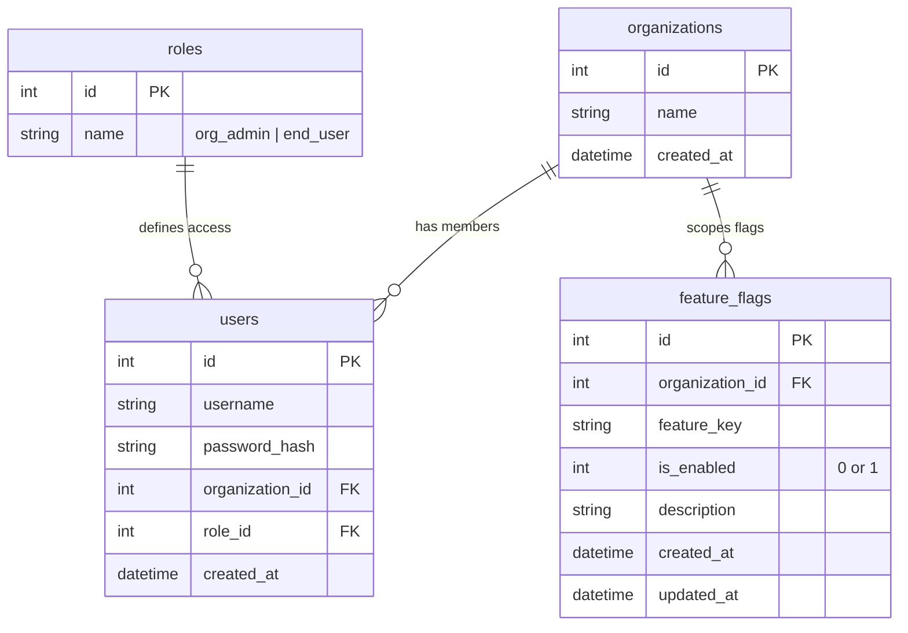

# Multi-Tenant Feature Flag Management System

A lightweight, multi-tenant SaaS-like feature flag management system designed to demonstrate clean API design, data scoping, role-based access control (RBAC), and user role flows.

The system is split into:
1. **Node.js/Express Backend** with SQLite storage and custom JWT-based authentication.
2. **Super Admin Frontend** for tenant organization registration.
3. **Organization Admin Frontend** for tenant administrators to register, manage feature flags, and provision end-user credentials.
4. **End User Frontend** for clients to check which feature flags are active for their specific organization.

---

## 🏛️ System Architecture & Scoping

This system implements **logical multi-tenancy** using a shared-database approach. Every tenant organization is mapped to a unique ID in the database. Feature flags and user accounts are strictly scoped to their respective `organization_id` column to guarantee logical data isolation between tenants.



---

## 👥 System Roles & Capabilities

### 1. Super Admin
* **Access**: Hardcoded config-based static credentials.
* **Responsibilities**:
  * Log in securely.
  * Create tenant organizations.
  * View directory statistics (total organizations, registered users/admins per tenant, total flags deployed).

### 2. Organization (Tenant) Admin
* **Access**: Can sign up under a registered organization and log in using database-backed credentials.
* **Responsibilities**:
  * Manage feature flags for their organization (Create, Toggle state, Delete).
  * Provision credentials for End Users (e.g. employees or client systems) scoped to their tenant.

### 3. End User
* **Access**: Logs in with credentials provisioned by their Organization Admin.
* **Responsibilities**:
  * Check the real-time status of feature keys (active/inactive) for their organization.

---

## ⚙️ Tech Stack & Constraints

* **Backend**: Node.js & Express framework.
* **Database**: SQLite3 (`sqlite3` module with a custom Promise-based wrapper for async/await operations).
* **Authentication**: Custom JWT authentication (`jsonwebtoken` + `bcryptjs` for password hashing). No external auth providers are used, maintaining full local control.
* **Frontend**: Three decoupled React applications built with Vite.
* **Styling**: Clean, standard, custom CSS stylesheet using the corporate-standard `Inter` font, avoiding flashy animations or AI-style neon/glassmorphism templates to keep the UI professional and authentic.

---

## 🚀 Running the Project

### Prerequisites
* [Node.js](https://nodejs.org/) (v16+ recommended)
* npm (v8+ recommended)

### 1. Install Dependencies
Run the installation command in the root folder to download package dependencies across the workspace:
```bash
npm install
cd backend && npm install
cd ../super-admin-frontend && npm install
cd ../admin-frontend && npm install
cd ../user-frontend && npm install
cd ..
```

### 2. Start All Services
You can spin up the backend server and all three frontends concurrently using the workspace launcher:
```bash
npm run start-all
```
This script starts:
* **Node.js Server**: [http://localhost:5001](http://localhost:5001)
* **Super Admin Portal**: [http://localhost:3001](http://localhost:3001) (Credentials: `superadmin` / `superadminpassword`)
* **Organization Admin Portal**: [http://localhost:3002](http://localhost:3002)
* **End User Tester Portal**: [http://localhost:3003](http://localhost:3003)

---

## 🧪 Verification & Testing

The backend includes a dedicated test script (`backend/verify.js`) that automatically simulates the entire SaaS lifecycle:
1. Log in as Super Admin.
2. Create test organizations.
3. Register tenant admins for each organization.
4. Authenticate as those admins and deploy unique sets of feature flags.
5. Create scoped end-user credentials.
6. Retrieve and verify that the flags are securely scoped to their respective tenants and return the correct boolean states.

### Running the API Test Suite:
To execute a clean integration test run:
1. Stop any running backend instances.
2. Reset the database to guarantee a clean slate:
   ```bash
   rm -f backend/database.sqlite
   ```
3. Start the backend:
   ```bash
   cd backend && npm run dev
   ```
4. In another terminal tab, run the test runner script:
   ```bash
   cd backend && node verify.js
   ```
5. You should see `All API tests passed successfully!` in your console.
